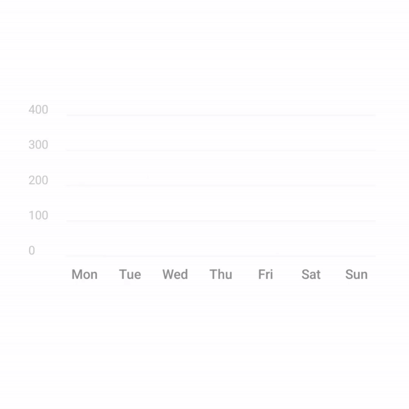
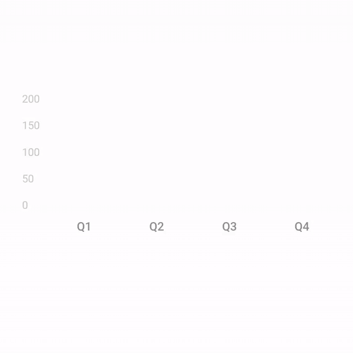
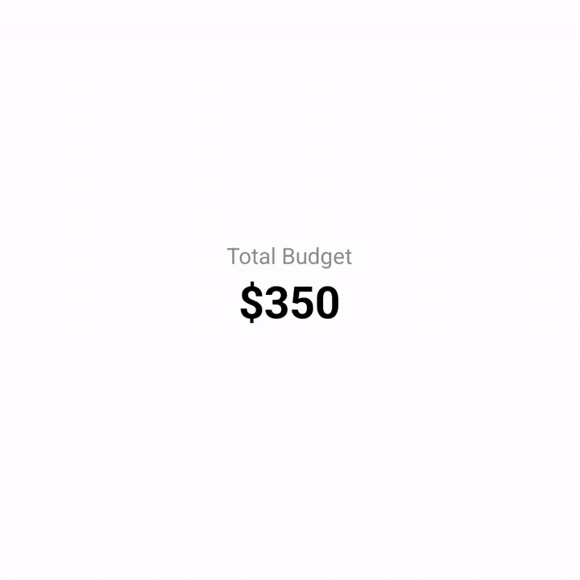
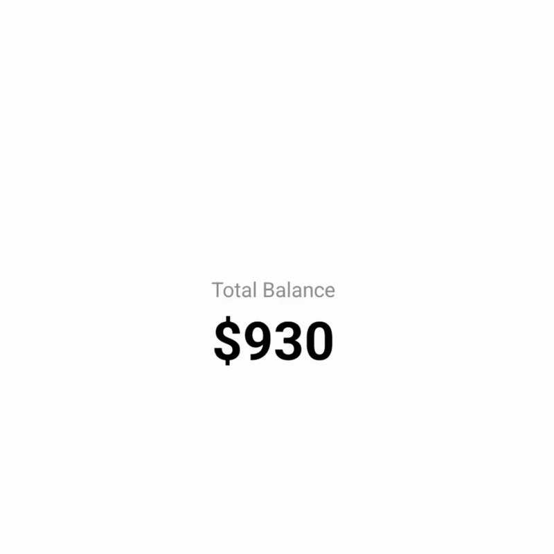
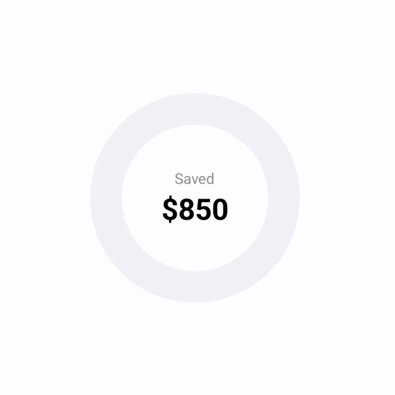
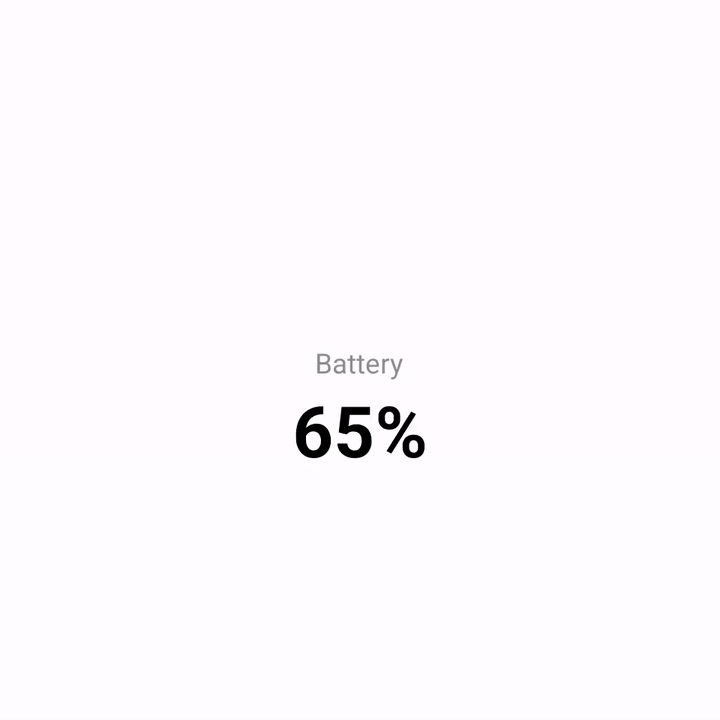
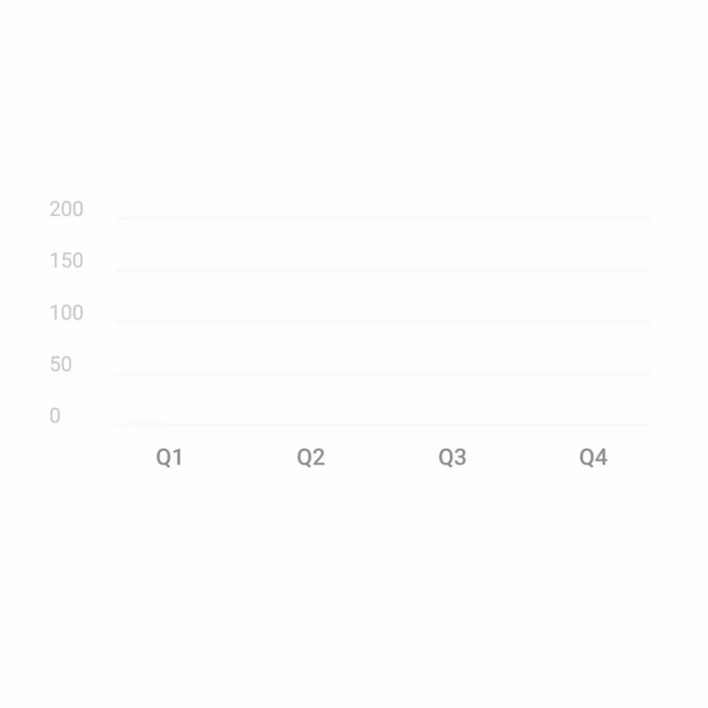

# @tubinex/react-native-charts

A collection of beautiful, customizable, and performant chart components for React Native.

[](https://www.npmjs.com/package/@tubinex/react-native-charts)
[](https://github.com/Tubinex/react-native-charts/blob/master/LICENSE)

## Features

- **High Performance** - Powered by React Native Skia for optimal rendering performance
- **Beautiful Animations** - Smooth animations powered by Reanimated 2
- **Interactive** - Built-in tap gesture support for charts
- **Highly Customizable** - Extensive props for styling and behavior
- **TypeScript** - Full TypeScript support

## Gallery

<table>
  <tr>
    <td align="center" width="33%">
      <br/>
      <b>BarChart</b>
    </td>
    <td align="center" width="33%">
      <br/>
      <b>GroupedBarChart</b>
    </td>
    <td align="center" width="33%">
      <br/>
      <b>StackedBarChart</b>
    </td>
  </tr>
  <tr>
    <td align="center" width="33%">
      <br/>
      <b>DonutChart</b>
    </td>
    <td align="center" width="33%">
      <br/>
      <b>SemiCircleChart</b>
    </td>
    <td align="center" width="33%">
      <br/>
      <b>DonutGauge</b>
    </td>
  </tr>
  <tr>
    <td align="center" width="33%">
      <br/>
      <b>SemiCircleGauge</b>
    </td>
    <td align="center" width="33%">
      <br/>
      <b>GroupedStackedBarChart</b>
    </td>
    <td align="center" width="33%">
    </td>
  </tr>
</table>

## Components

### Charts

- **BarChart** - Animated vertical bar chart with Y-axis labels and interactive bar selection
- **GroupedBarChart** - Multiple bars per category for comparing values across groups
- **StackedBarChart** - Stacked segments showing part-to-whole relationships
- **GroupedStackedBarChart** - Advanced chart combining grouped and stacked bar features
- **AreaChart** - Filled area chart with smooth curves and interactive exploration
- **LineChart** - Line chart with smooth curves and interactive data points
- **DonutChart** - Full circle chart with multiple segments
- **SemiCircleChart** - Half circle chart with multiple segments
- **RadialChart** - Base component for custom radial charts

### Gauges

- **DonutGauge** - Full circle progress gauge (0-100%)
- **SemiCircleGauge** - Half circle progress gauge (0-100%)
- **RadialGauge** - Base component for custom gauges

## Installation

```bash
npm install @tubinex/react-native-charts
# or
yarn add @tubinex/react-native-charts
```

### Peer Dependencies

This library requires the following peer dependencies:

```bash
npm install @shopify/react-native-skia react-native-reanimated react-native-gesture-handler
# or
yarn add @shopify/react-native-skia react-native-reanimated react-native-gesture-handler
```

**Important**: After installing `react-native-reanimated`, add the Reanimated plugin to your `babel.config.js`:

```javascript
module.exports = {
	...
	plugins: [
		'react-native-worklets/plugin' // Add this line
	]
};
```

## Global Touch Provider Setup

Wrap your application with the `GlobalTouchProvider` so charts can observe touches without stealing gestures. From any `onPressOutside` handler you can call `event.preventDefault()` to keep the current selection active, for example when a different pressable already consumed the tap.

```tsx
import { GestureHandlerRootView } from 'react-native-gesture-handler';
import { GlobalTouchProvider } from '@tubinex/react-native-charts';

export default function App() {
	return (
		<GestureHandlerRootView style={{ flex: 1 }}>
			<GlobalTouchProvider>
				...
			</GlobalTouchProvider>
		</GestureHandlerRootView>
	);
}
```

## API Reference

### BarChart

<p align="center">
  
</p>

Animated vertical bar chart with interactive bar selection.

<details>
<summary><b>View Props & Example</b></summary>

| Prop | Type | Default | Description |
|------|------|---------|-------------|
| `data` | `BarData[]` | **required** | Array of data points for the bars |
| `width` | `number` | `320` | Width of the chart in pixels |
| `height` | `number` | `180` | Height of the chart in pixels |
| `barColor` | `string` | `'#7ED957'` | Default color for bars (can be overridden per bar) |
| `cornerRadius` | `number \| CornerRadius` | `6` | Corner radius for bars |
| `barGap` | `number` | `8` | Gap between bars in pixels |
| `showValues` | `boolean` | `false` | Whether to show value labels above bars |
| `valueFormatter` | `(value: number) => string` | `undefined` | Custom formatter for value labels |
| `animationDuration` | `number` | `1000` | Duration of animation in milliseconds |
| `maxValue` | `number` | `auto` | Override max value for Y-axis scaling |
| `xAxis` | `AxisConfig` | `undefined` | X-axis configuration (labels, ticks, grid) |
| `yAxis` | `AxisConfig` | `undefined` | Y-axis configuration (labels, ticks, grid) |
| `onBarPress` | `(index: number) => void` | `undefined` | Callback when a bar is pressed |
| `selectedBarIndex` | `number` | `-1` | Index of currently selected bar |
| `selectionStyle` | `SelectionStyleConfig` | `undefined` | Configuration for selected bar appearance (color, scale, border) |
| `onPressOutside` | `(event: ChartPressOutsideEvent) => void` | `undefined` | Called when a touch occurs outside the chart while a bar is selected |
| `deselectOnPressOutside` | `boolean` | `false` | Automatically clear selection after outside touches unless `event.preventDefault()` is called |
| `chartGestureRef` | `React.RefObject<any>` | `undefined` | Ref for the chart's gesture handler |

**Types:**
```typescript
interface BarData {
	value: number;
	label: string;
	color?: string;
	showValue?: boolean;
	selectionConfig?: ItemSelectionConfig;
}
```

**Example:**
```tsx
const [selectedBar, setSelectedBar] = useState(-1);

<BarChart
	data={[
		{ value: 120, label: 'Mon', color: '#7ED957' },
		{ value: 250, label: 'Tue', color: '#7ED957' },
		{ value: 180, label: 'Wed', color: '#7ED957' },
		{ value: 320, label: 'Thu', color: '#7ED957' },
		{ value: 210, label: 'Fri', color: '#7ED957' },
		{ value: 280, label: 'Sat', color: '#7ED957' },
		{ value: 150, label: 'Sun', color: '#7ED957' },
	]}
	selectedBarIndex={selectedBar}
	selectionStyle={{ color: '#5FB837', scale: 1.1 }}
	onBarPress={(index) => setSelectedBar(index === selectedBar ? -1 : index)}
	valueFormatter={(value) => `$${value}`}
	width={320}
	height={200}
	barGap={8}
	yAxis={{ show: true }}
/>
```
</details>

---

### GroupedBarChart

<p align="center">
  
</p>

Display multiple bars per category for comparing values across groups.

<details>
<summary><b>View Props & Example</b></summary>

| Prop | Type | Default | Description |
|------|------|---------|-------------|
| `data` | `GroupedBarData[]` | **required** | Array of categories with multiple bars |
| `width` | `number` | `320` | Width of the chart in pixels |
| `height` | `number` | `180` | Height of the chart in pixels |
| `cornerRadius` | `number \| CornerRadius` | `6` | Corner radius for bars |
| `groupGap` | `number` | `16` | Gap between bar groups in pixels |
| `barGap` | `number` | `4` | Gap between bars within a group |
| `animationDuration` | `number` | `1000` | Duration of animation in milliseconds |
| `onBarPress` | `(categoryIndex: number, barIndex: number) => void` | `undefined` | Callback when a bar is pressed |
| `selectedCategoryIndex` | `number` | `-1` | Index of currently selected category |
| `selectedBarIndex` | `number` | `-1` | Index of currently selected bar within category |
| `selectionStyle` | `SelectionStyleConfig` | `undefined` | Configuration for selected bar appearance |
| `xAxis` | `AxisConfig` | `undefined` | X-axis configuration |
| `yAxis` | `AxisConfig` | `undefined` | Y-axis configuration |

**Types:**
```typescript
interface GroupedBarData {
	category: string;
	bars: { value: number; color: string; label?: string }[];
}
```

**Example:**
```tsx
<GroupedBarChart
	data={[
		{
			category: 'Q1',
			bars: [
				{ value: 120, color: '#7ED957', label: 'Revenue' },
				{ value: 85, color: '#FFB800', label: 'Expenses' },
			],
		},
		{
			category: 'Q2',
			bars: [
				{ value: 150, color: '#7ED957', label: 'Revenue' },
				{ value: 95, color: '#FFB800', label: 'Expenses' },
			],
		},
		{
			category: 'Q3',
			bars: [
				{ value: 180, color: '#7ED957', label: 'Revenue' },
				{ value: 110, color: '#FFB800', label: 'Expenses' },
			],
		},
		{
			category: 'Q4',
			bars: [
				{ value: 200, color: '#7ED957', label: 'Revenue' },
				{ value: 120, color: '#FFB800', label: 'Expenses' },
			],
		},
	]}
	groupGap={16}
	barGap={6}
	yAxis={{ show: true }}
/>
```
</details>

---

### StackedBarChart

<p align="center">
  
</p>

Stacked bar chart showing part-to-whole relationships with interactive segments.

<details>
<summary><b>View Props & Example</b></summary>

| Prop | Type | Default | Description |
|------|------|---------|-------------|
| `data` | `StackedBarData[]` | **required** | Array of categories with stacked segments |
| `width` | `number` | `320` | Width of the chart in pixels |
| `height` | `number` | `180` | Height of the chart in pixels |
| `cornerRadius` | `number \| CornerRadius` | `6` | Corner radius for bars |
| `groupGap` | `number` | `16` | Gap between stacked bars |
| `stackGap` | `number` | `0` | Gap between segments within a stack |
| `animationDuration` | `number` | `1000` | Duration of animation in milliseconds |
| `selectedCategoryIndex` | `number` | `-1` | Index of currently selected category |
| `selectedSegmentIndex` | `number` | `-1` | Index of currently selected segment |
| `selectionStyle` | `SelectionStyleConfig` | `undefined` | Configuration for selected segment appearance |
| `xAxis` | `AxisConfig` | `undefined` | X-axis configuration |
| `yAxis` | `AxisConfig` | `undefined` | Y-axis configuration |

**Types:**
```typescript
interface StackedBarData {
	category: string;
	stack: { value: number; color: string; label?: string }[];
}
```

**Example:**
```tsx
<StackedBarChart
	data={[
		{
			category: 'Jan',
			stack: [
				{ value: 120, color: '#7ED957', label: 'Housing' },
				{ value: 80, color: '#FFB800', label: 'Food' },
				{ value: 50, color: '#FF5C5C', label: 'Transport' },
			],
		},
		{
			category: 'Feb',
			stack: [
				{ value: 120, color: '#7ED957', label: 'Housing' },
				{ value: 90, color: '#FFB800', label: 'Food' },
				{ value: 45, color: '#FF5C5C', label: 'Transport' },
			],
		},
		{
			category: 'Mar',
			stack: [
				{ value: 120, color: '#7ED957', label: 'Housing' },
				{ value: 85, color: '#FFB800', label: 'Food' },
				{ value: 55, color: '#FF5C5C', label: 'Transport' },
			],
		},
		{
			category: 'Apr',
			stack: [
				{ value: 120, color: '#7ED957', label: 'Housing' },
				{ value: 95, color: '#FFB800', label: 'Food' },
				{ value: 60, color: '#FF5C5C', label: 'Transport' },
			],
		},
		{
			category: 'May',
			stack: [
				{ value: 120, color: '#7ED957', label: 'Housing' },
				{ value: 100, color: '#FFB800', label: 'Food' },
				{ value: 50, color: '#FF5C5C', label: 'Transport' },
			],
		},
		{
			category: 'Jun',
			stack: [
				{ value: 120, color: '#7ED957', label: 'Housing' },
				{ value: 110, color: '#FFB800', label: 'Food' },
				{ value: 65, color: '#FF5C5C', label: 'Transport' },
			],
		},
	]}
	stackGap={2}
	yAxis={{ show: true }}
/>
```
</details>

---

### GroupedStackedBarChart

<p align="center">
  
</p>

Advanced chart combining grouped and stacked bar features for complex data visualization.

<details>
<summary><b>View Props & Example</b></summary>

| Prop | Type | Default | Description |
|------|------|---------|-------------|
| `data` | `GroupedBarData[] \| StackedBarData[]` | **required** | Array of grouped or stacked data |
| `width` | `number` | `320` | Width of the chart in pixels |
| `height` | `number` | `180` | Height of the chart in pixels |
| `cornerRadius` | `number \| CornerRadius` | `6` | Corner radius for bars |
| `groupGap` | `number` | `16` | Gap between bar groups |
| `barGap` | `number` | `4` | Gap between bars within a group |
| `stackGap` | `number` | `0` | Gap between segments in stacks |
| `animationDuration` | `number` | `1000` | Duration of animation in milliseconds |
| `onBarPress` | `(categoryIndex: number, barIndex?: number) => void` | `undefined` | Callback when a bar is pressed |
| `selectedCategoryIndex` | `number` | `-1` | Index of currently selected category |
| `selectedBarIndex` | `number` | `-1` | Index of currently selected bar |
| `selectedSegmentIndex` | `number` | `-1` | Index of currently selected segment |
| `selectionStyle` | `SelectionStyleConfig` | `undefined` | Configuration for selected item appearance |

**Example:**
```tsx
// Grouped stacked bars - multiple stacked bars per quarter
<GroupedStackedBarChart
	data={[
		{
			category: 'Q1',
			bars: [
				{
					value: 120,
					color: '#7ED957',
					stack: [
						{ value: 50, color: '#7ED957' },
						{ value: 40, color: '#5FB837' },
						{ value: 30, color: '#4A9629' },
					],
				},
				{
					value: 100,
					color: '#FFB800',
					stack: [
						{ value: 45, color: '#FFB800' },
						{ value: 30, color: '#CC9600' },
						{ value: 25, color: '#997100' },
					],
				},
			],
		},
		{
			category: 'Q2',
			bars: [
				{
					value: 150,
					color: '#7ED957',
					stack: [
						{ value: 60, color: '#7ED957' },
						{ value: 50, color: '#5FB837' },
						{ value: 40, color: '#4A9629' },
					],
				},
				{
					value: 125,
					color: '#FFB800',
					stack: [
						{ value: 55, color: '#FFB800' },
						{ value: 40, color: '#CC9600' },
						{ value: 30, color: '#997100' },
					],
				},
			],
		},
		{
			category: 'Q3',
			bars: [
				{
					value: 175,
					color: '#7ED957',
					stack: [
						{ value: 70, color: '#7ED957' },
						{ value: 60, color: '#5FB837' },
						{ value: 45, color: '#4A9629' },
					],
				},
				{
					value: 145,
					color: '#FFB800',
					stack: [
						{ value: 60, color: '#FFB800' },
						{ value: 50, color: '#CC9600' },
						{ value: 35, color: '#997100' },
					],
				},
			],
		},
		{
			category: 'Q4',
			bars: [
				{
					value: 200,
					color: '#7ED957',
					stack: [
						{ value: 80, color: '#7ED957' },
						{ value: 70, color: '#5FB837' },
						{ value: 50, color: '#4A9629' },
					],
				},
				{
					value: 165,
					color: '#FFB800',
					stack: [
						{ value: 70, color: '#FFB800' },
						{ value: 55, color: '#CC9600' },
						{ value: 40, color: '#997100' },
					],
				},
			],
		},
	]}
	groupGap={16}
	barGap={6}
	stackGap={2}
	yAxis={{ show: true }}
/>
```
</details>

---

### AreaChart

Filled area chart with smooth curves, interactive exploration, and customizable styling.

<details>
<summary><b>View Props & Example</b></summary>

| Prop | Type | Default | Description |
|------|------|---------|-------------|
| `data` | `{ x: number; y: number; label?: string }[]` | **required** | Array of data points with x and y coordinates |
| `width` | `number` | `320` | Width of the chart in pixels |
| `height` | `number` | `200` | Height of the chart in pixels |
| `fillColor` | `string` | `'rgba(126, 217, 87, 0.25)'` | Fill color for the area |
| `strokeColor` | `string` | `'rgba(126, 217, 87, 1)'` | Line color |
| `strokeWidth` | `number` | `2` | Line thickness in pixels |
| `smooth` | `boolean` | `true` | Use smooth curves instead of straight lines |
| `animationDuration` | `number` | `1200` | Animation duration in milliseconds |
| `showPoints` | `boolean` | `false` | Show data points on the line |
| `pointRadius` | `number` | `4` | Radius of data points |
| `pointColor` | `string` | `strokeColor` | Color of data points |
| `selectedPointIndex` | `number` | `-1` | Index of currently selected point |
| `selectedPointRadius` | `number` | `8` | Radius of selected point |
| `onPointPress` | `(index: number) => void` | `undefined` | Callback when a point is pressed |
| `onPressOutside` | `(event: ChartPressOutsideEvent) => void` | `undefined` | Called when a touch occurs outside the chart |
| `deselectOnPressOutside` | `boolean` | `false` | Automatically clear selection on outside touches |
| `xAxis` | `AxisConfig` | `undefined` | X-axis configuration |
| `yAxis` | `AxisConfig` | `undefined` | Y-axis configuration |
| `minX` | `number` | `auto` | Minimum X value for scaling |
| `maxX` | `number` | `auto` | Maximum X value for scaling |
| `minY` | `number` | `auto` | Minimum Y value for scaling |
| `maxY` | `number` | `auto` | Maximum Y value for scaling |
| `explorer` | `ExplorerConfig` | `undefined` | Interactive exploration configuration |

**Explorer Config:**
```typescript
interface ExplorerConfig {
  enabled: boolean;
  snapToPoint?: boolean; // Default: true
  showLine?: boolean; // Default: true
  showDot?: boolean; // Default: true
  lineColor?: string;
  lineWidth?: number;
  dotColor?: string;
  dotRadius?: number;
  inactiveColor?: string;
  initialIndex?: number;
  onMove?: (index: number, point: { x: number; y: number; label?: string }) => void;
}
```

**Example:**
```tsx
<AreaChart
  data={[
    { x: 0, y: 120, label: 'Jan' },
    { x: 1, y: 180, label: 'Feb' },
    { x: 2, y: 150, label: 'Mar' },
    { x: 3, y: 220, label: 'Apr' },
    { x: 4, y: 190, label: 'May' },
    { x: 5, y: 280, label: 'Jun' },
  ]}
  width={320}
  height={200}
  fillColor="rgba(126, 217, 87, 0.3)"
  strokeColor="#7ED957"
  strokeWidth={2}
  smooth={true}
  showPoints={true}
  pointRadius={4}
  explorer={{
    enabled: true,
    snapToPoint: true,
    showLine: true,
    showDot: true,
    lineColor: '#7ED957',
    dotRadius: 6,
    inactiveColor: '#E5E7EB',
    onMove: (index, point) => {
      console.log(`Selected point ${index}:`, point);
    },
  }}
  yAxis={{ show: true, grid: { show: true } }}
  xAxis={{ show: true }}
/>
```
</details>

---

### LineChart

Line chart with smooth curves and interactive data points. Shares the same props as AreaChart but with a transparent fill.

<details>
<summary><b>View Props & Example</b></summary>

| Prop | Type | Default | Description |
|------|------|---------|-------------|
| `data` | `{ x: number; y: number; label?: string }[]` | **required** | Array of data points with x and y coordinates |
| `width` | `number` | `320` | Width of the chart in pixels |
| `height` | `number` | `200` | Height of the chart in pixels |
| `strokeColor` | `string` | `'#7ED957'` | Line color |
| `strokeWidth` | `number` | `2` | Line thickness in pixels |
| `smooth` | `boolean` | `true` | Use smooth curves instead of straight lines |
| `pointColor` | `string` | `strokeColor` | Color of data points |

All other props are the same as [AreaChart](#areachart).

**Example:**
```tsx
<LineChart
  data={[
    { x: 0, y: 120, label: 'Mon' },
    { x: 1, y: 180, label: 'Tue' },
    { x: 2, y: 150, label: 'Wed' },
    { x: 3, y: 220, label: 'Thu' },
    { x: 4, y: 190, label: 'Fri' },
    { x: 5, y: 280, label: 'Sat' },
    { x: 6, y: 210, label: 'Sun' },
  ]}
  width={320}
  height={200}
  strokeColor="#7ED957"
  strokeWidth={3}
  smooth={true}
  showPoints={true}
  pointRadius={5}
  explorer={{
    enabled: true,
    snapToPoint: true,
    onMove: (index, point) => {
      console.log(`Point ${index}: ${point.y}`);
    },
  }}
  yAxis={{ show: true }}
/>
```
</details>

---

### DonutChart

<p align="center">
  
</p>

Full circle chart with multiple segments and custom center content.

<details>
<summary><b>View Props & Example</b></summary>

| Prop | Type | Default | Description |
|------|------|---------|-------------|
| `segments` | `ChartSegment[]` | **required** | Array of segments to display |
| `size` | `number` | `260` | Size (width/height) in pixels |
| `strokeWidth` | `number` | `34` | Thickness of the ring |
| `cornerRadius` | `number` | `8` | Corner radius for segment ends |
| `segmentGap` | `number` | `0` | Gap between segments in degrees |
| `backgroundColor` | `string` | `undefined` | Background ring color |
| `animationDuration` | `number` | `1200` | Animation duration in milliseconds |
| `centerContent` | `React.ReactNode` | `undefined` | Custom content for center |
| `onSegmentPress` | `(index: number) => void` | `undefined` | Callback when segment is tapped |
| `selectedSegmentIndex` | `number` | `-1` | Currently selected segment index |
| `selectedStrokeWidthIncrease` | `number` | `15` | Additional stroke width for selected segment |
| `selectionAnimationDuration` | `number` | `200` | Duration of selection animation |
| `onPressOutside` | `(event: ChartPressOutsideEvent) => void` | `undefined` | Called when a touch occurs outside the chart |
| `deselectOnPressOutside` | `boolean` | `false` | Automatically clear selection on outside touches |
| `chartGestureRef` | `React.RefObject<any>` | `undefined` | Ref for the chart's gesture handler |

**Types:**
```typescript
interface ChartSegment {
	value: number;
	color: string;
	label?: string;
}
```

**Example:**
```tsx
const [selectedIndex, setSelectedIndex] = useState(-1);

<DonutChart
	segments={[
		{ value: 120, color: '#7ED957', label: 'Housing' },
		{ value: 90, color: '#FFB800', label: 'Food' },
		{ value: 60, color: '#FF5C5C', label: 'Transport' },
		{ value: 45, color: '#3B82F6', label: 'Entertainment' },
		{ value: 35, color: '#8B5CF6', label: 'Utilities' },
	]}
	segmentGap={4}
	centerContent={
		<View style={{ alignItems: 'center' }}>
			<Text style={{ fontSize: 14, color: '#8E8E93' }}>Total Budget</Text>
			<Text style={{ fontSize: 28, fontWeight: '700' }}>$350</Text>
		</View>
	}
	selectedSegmentIndex={selectedIndex}
	onSegmentPress={(index) => {
		setSelectedIndex(index === selectedIndex ? -1 : index);
	}}
/>
```
</details>

---

### DonutGauge

<p align="center">
  
</p>

Full circle progress gauge for single progress values.

<details>
<summary><b>View Props & Example</b></summary>

| Prop | Type | Default | Description |
|------|------|---------|-------------|
| `progress` | `number` (0-100) | **required** | Progress percentage |
| `color` | `string` | `'#7ED957'` | Color for the progress segment |
| `size` | `number` | `260` | Size (width/height) in pixels |
| `strokeWidth` | `number` | `34` | Thickness of the ring |
| `cornerRadius` | `number` | `8` | Corner radius for segment ends |
| `backgroundColor` | `string` | `'#F2F2F7'` | Background ring color |
| `animationDuration` | `number` | `1200` | Animation duration in milliseconds |
| `centerContent` | `React.ReactNode` | `undefined` | Custom content for center |

**Example:**
```tsx
<DonutGauge
	progress={85}
	color="#7ED957"
	size={200}
	strokeWidth={30}
	centerContent={
		<View style={{ alignItems: 'center' }}>
			<Text style={{ fontSize: 14, color: '#8E8E93' }}>Saved</Text>
			<Text style={{ fontSize: 28, fontWeight: '700' }}>$850</Text>
		</View>
	}
/>
```
</details>

---

### SemiCircleChart

<p align="center">
  
</p>

Half circle chart with multiple segments and custom center content.

<details>
<summary><b>View Props & Example</b></summary>

| Prop | Type | Default | Description |
|------|------|---------|-------------|
| `segments` | `ChartSegment[]` | **required** | Array of segments to display |
| `maxValue` | `number` | `auto` | Override max value for segment scaling |
| `size` | `number` | `280` | Size (width/height) in pixels |
| `strokeWidth` | `number` | `40` | Thickness of the gauge ring |
| `cornerRadius` | `number` | `8` | Corner radius for segment ends |
| `segmentGap` | `number` | `0` | Gap between segments in degrees |
| `backgroundColor` | `string` | `'#F2F2F7'` | Background gauge color |
| `animationDuration` | `number` | `1200` | Animation duration in milliseconds |
| `centerContent` | `React.ReactNode` | `undefined` | Custom content for center |
| `contentAlignment` | `'center' \| 'flex-start' \| 'flex-end'` | `'flex-end'` | Center content alignment |
| `onSegmentPress` | `(index: number) => void` | `undefined` | Callback when segment is tapped |
| `selectedSegmentIndex` | `number` | `-1` | Currently selected segment index |
| `selectedStrokeWidthIncrease` | `number` | `15` | Additional stroke width for selected segment |
| `selectionAnimationDuration` | `number` | `200` | Duration of selection animation |
| `onPressOutside` | `(event: ChartPressOutsideEvent) => void` | `undefined` | Called when a touch occurs outside the chart |
| `deselectOnPressOutside` | `boolean` | `false` | Automatically clear selection on outside touches |
| `chartGestureRef` | `React.RefObject<any>` | `undefined` | Ref for the chart's gesture handler |

**Example:**
```tsx
<SemiCircleChart
	segments={[
		{ value: 450, color: '#7ED957', label: 'Savings' },
		{ value: 280, color: '#FFB800', label: 'Spending' },
		{ value: 120, color: '#FF5C5C', label: 'Bills' },
		{ value: 80, color: '#3B82F6', label: 'Investments' },
	]}
	size={300}
	strokeWidth={45}
	segmentGap={4}
	centerContent={
		<View style={{ alignItems: 'center' }}>
			<Text style={{ fontSize: 14, color: '#8E8E93' }}>Total Balance</Text>
			<Text style={{ fontSize: 36, fontWeight: '700' }}>$930</Text>
		</View>
	}
	contentAlignment="flex-end"
/>
```
</details>

---

### SemiCircleGauge

<p align="center">
  
</p>

Half circle progress gauge for single progress values.

<details>
<summary><b>View Props & Example</b></summary>

| Prop | Type | Default | Description |
|------|------|---------|-------------|
| `progress` | `number` (0-100) | **required** | Progress percentage |
| `color` | `string` | `'#7ED957'` | Color for the progress segment |
| `size` | `number` | `280` | Size (width/height) in pixels |
| `strokeWidth` | `number` | `40` | Thickness of the gauge ring |
| `cornerRadius` | `number` | `8` | Corner radius for segment ends |
| `backgroundColor` | `string` | `'#F2F2F7'` | Background gauge color |
| `animationDuration` | `number` | `1200` | Animation duration in milliseconds |
| `centerContent` | `React.ReactNode` | `undefined` | Custom content for center |
| `contentAlignment` | `'center' \| 'flex-start' \| 'flex-end'` | `'flex-end'` | Center content alignment |

**Example:**
```tsx
<SemiCircleGauge
	progress={65}
	color="#FFB800"
	centerContent={
		<View style={{ alignItems: 'center' }}>
			<Text style={{ fontSize: 14, color: '#8E8E93' }}>Battery</Text>
			<Text style={{ fontSize: 36, fontWeight: '700' }}>65%</Text>
		</View>
	}
	contentAlignment="flex-end"
/>
```
</details>

---

### RadialChart

Radial/circular chart component for custom implementations. See `RadialGauge` for gauge-specific wrapper.

<details>
<summary><b>View Props</b></summary>

| Prop | Type | Default | Description |
|------|------|---------|-------------|
| `segments` | `ChartSegment[]` | **required** | Array of segments to display |
| `maxValue` | `number` | `auto` | Override max value for segment scaling |
| `size` | `number` | `280` | Size (width/height) in pixels |
| `strokeWidth` | `number` | `40` | Thickness of the ring |
| `cornerRadius` | `number` | `8` | Corner radius for segment ends |
| `segmentGap` | `number` | `0` | Gap between segments in degrees |
| `startAngle` | `number` | `-90` | Starting angle in degrees (-90 is top) |
| `sweepAngle` | `number` | `360` | Total sweep angle (360 = full circle, 180 = half circle) |
| `viewBoxHeightRatio` | `number` | `1` | Height ratio for viewBox (0.6 for semicircle) |
| `centerContent` | `React.ReactNode` | `undefined` | Custom content for center |
| `closedLoop` | `boolean` | `false` | Include gap after last segment |
| `contentAlignment` | `'center' \| 'flex-start' \| 'flex-end'` | `'center'` | Center content alignment |
| `backgroundColor` | `string` | `undefined` | Background ring color |
| `animationDuration` | `number` | `1200` | Animation duration in milliseconds |
| `onSegmentPress` | `(index: number) => void` | `undefined` | Callback when segment is tapped |
| `selectedSegmentIndex` | `number` | `-1` | Currently selected segment index |
| `selectedStrokeWidthIncrease` | `number` | `15` | Additional stroke width for selected segment |
| `selectionAnimationDuration` | `number` | `200` | Duration of selection animation |
| `selectionExpandMode` | `'scale' \| 'expand'` | `'expand'` | How selection expands (scale = stroke width, expand = radius) |
| `onPressOutside` | `(event: ChartPressOutsideEvent) => void` | `undefined` | Called when a touch occurs outside the chart |
| `deselectOnPressOutside` | `boolean` | `false` | Automatically clear selection on outside touches |
| `chartGestureRef` | `React.RefObject<any>` | `undefined` | Ref for the chart's gesture handler |
</details>

---

## TypeScript Support

Full TypeScript support with comprehensive type definitions:

```typescript
import type {
	// Bar Charts
	BarData,
	BarChartProps,
	GroupedBarData,
	GroupedBarChartProps,
	StackedBarData,
	StackedBarChartProps,
	GroupedStackedBarChartProps,

	// Line & Area Charts
	AreaChartProps,
	LineChartProps,
	ExplorerConfig,

	// Radial Charts
	ChartSegment,
	DonutChartProps,
	SemiCircleChartProps,
	RadialChartProps,

	// Gauges
	DonutGaugeProps,
	SemiCircleGaugeProps,
	RadialGaugeProps,

	// Shared Types
	ContentAlignment,
	CornerRadius,
	AxisConfig,
	SelectionStyleConfig,
	ChartPressOutsideEvent,
} from '@tubinex/react-native-charts';
```

## Performance Tips

1. **Memoize data arrays** - Use `useMemo` to prevent unnecessary re-renders
2. **Avoid inline functions** - Define callbacks outside render
3. **Limit segments** - Keep segments under 20 for optimal performance
4. **Memoize center content** - Use `useMemo` for complex center content

```tsx
const data = useMemo(
	() => [
		{ value: 100, label: 'A' },
		{ value: 200, label: 'B' },
	],
	[]
);

const handlePress = useCallback((index: number) => {
	console.log('Pressed:', index);
}, []);

const centerContent = useMemo(
	() => (
		<View>
			<Text>Total</Text>
			<Text>$300</Text>
		</View>
	),
	[]
);

<DonutChart
	segments={data}
	onSegmentPress={handlePress}
	centerContent={centerContent}
/>
```

## License

MIT © [Tubinex](https://github.com/Tubinex)

## Credits

Built with:
- [@shopify/react-native-skia](https://github.com/Shopify/react-native-skia)
- [react-native-reanimated](https://github.com/software-mansion/react-native-reanimated)
- [react-native-gesture-handler](https://github.com/software-mansion/react-native-gesture-handler)
